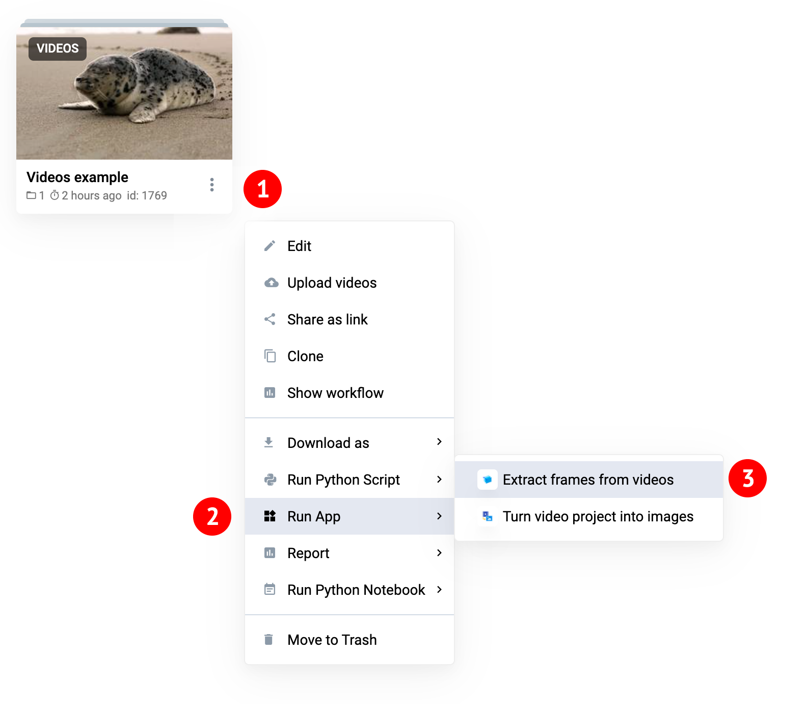
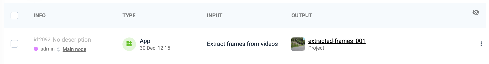
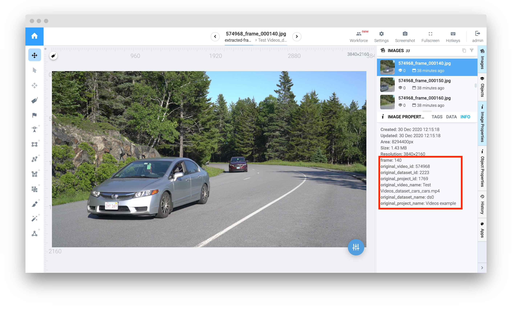

<div align="center" markdown>


# Extract Frames from Videos

<p align="center">
  <a href="#Overview">Overview</a> •
  <a href="#How-To-Use">How To Use</a>
</p>


[](https://ecosystem.supervise.ly/apps/extract-frames-from-videos)
[](https://supervise.ly/slack)

[](https://supervise.ly)
[](https://supervise.ly)

</div>

## Overview

App allows to extract video frames to images project without labels. User should define **frames step**, and **datasets structure** (keep original structure or save frames for every video to separate dataset) and **result project name**. 

Images will have name in the following structure: `{original video id}_frame_{frame index}.jpg`. Also additional meta information is attached to every frame and available in image labeling tool. For example: 
```json
{
    "original_project_id": 333,
    "original_project_name": "my-video-project",
    "original_dataset_id": 444,
    "original_dataset_name": "roads",
    "original_video_id": "7484736",
    "original_video_name": "cars.mp4",
    "frame": 15
}
```

## How To Use

**Step 1:** Add app to your team from Ecosystem if it is not there

**Step 2:** Run app from context menu of video project or dataset: 



**Step 3:** Define settings


**Step 4:** Wait until task is finished. Result project is created in the same workspace.



Every extracted frame has metainformation about original video:



